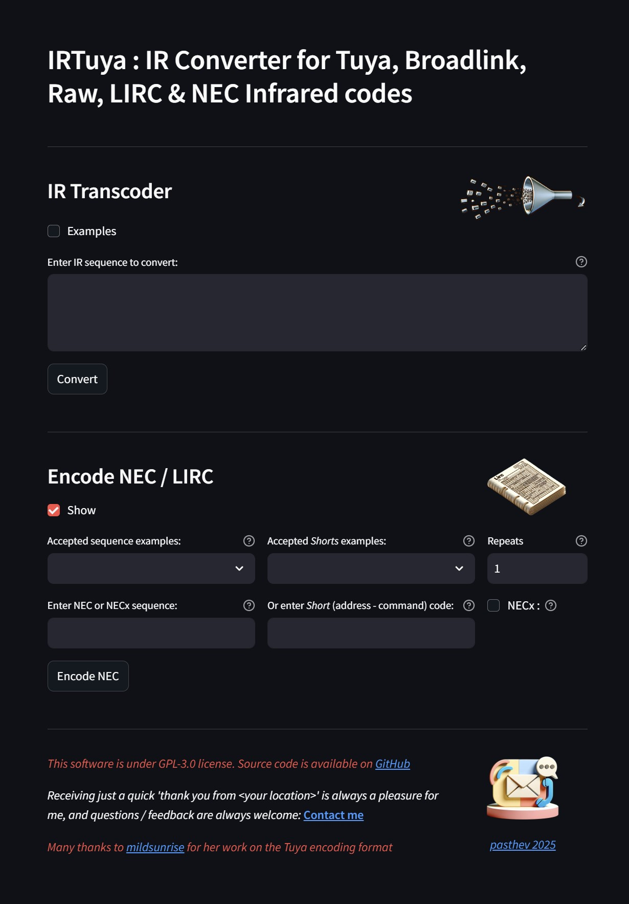
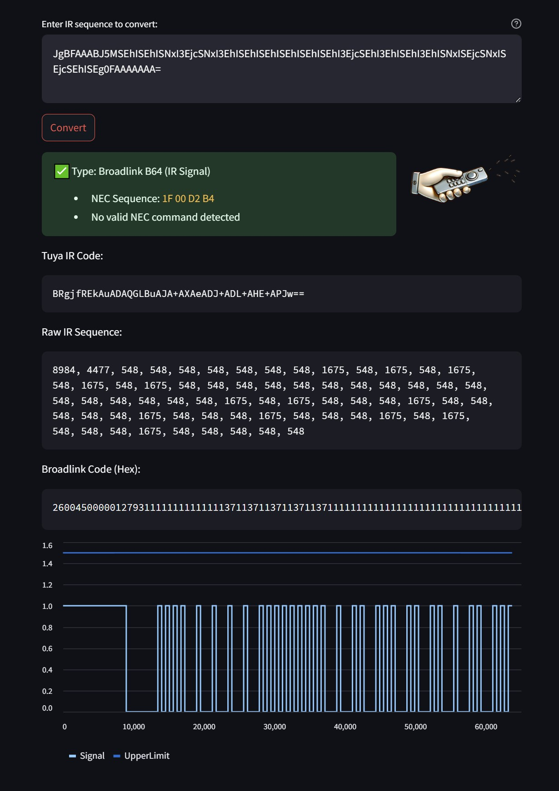

# IRTuya

IRTuya is an open-source IR code converter that supports multiple infrared remote control formats, including Tuya, Broadlink (Base64 and Hex), Raw, NEC, and LIRC. The application is available on [Streamlit](https://share.streamlit.io/) and its source code is hosted on [GitHub](https://github.com/pasthev/irtuya).

<div style="text-align: center;">
  <a href="https://irtuya.streamlit.app/" style="font-size: 2em; font-weight: bold; display: block; margin-top: 0.5em; margin-bottom: 0.5em;">Access IRTuya online</a>
</div>


## Description

IRTuya is designed to facilitate the conversion and analysis of infrared signals used in various remote control systems. It provides functionalities to decode, convert, and analyze a range of IR code formats:

- **Tuya IR Codes**: Decode Tuya-specific compressed IR code strings into raw IR signal durations.
- **Broadlink Codes**: Convert between Broadlink Hex and Base64 formats and raw IR signals.
- **NEC/NECx Codes**: Decode and encode standard NEC and NEC Extended (NECx) commands.
- **Raw IR Sequences**: Directly manipulate and visualize raw IR data.

The program leverages efficient algorithms for decoding and compression (using FastLZ) and offers a user-friendly interface built with Streamlit. This makes it, I hope, a valuable tool for hobbyists and developers working with IR-controlled devices.

<div style="text-align: center;">
    
</div>

## Usage

IRTuya provides a straightforward interface with an omnibox for converting and analyzing IR codes:

1. **IR Transcoder**
   - **Input**: Paste your IR code in one of the supported formats (Tuya, Broadlink, NEC, or Raw) into the provided text area.
   - **Conversion**: Click the "Convert" button to decode and visualize the IR signal.
   - **Output**: The application displays:
     - The decoded IR sequence in *Raw* format.
     - conversions, such as the Tuya code, Broadlink Hex, and Broadlink Base64 formats.
     - A graphic representation of the IR signal.
   
2. **NEC / LIRC Sequences & Commands Encoder**
   - **Input**: Enter a full NEC sequence or a short (address-command) code.
   - **Options**: Optionally select the NEC Extended (NECx) format and specify the number of repeats.
   - **Encoding**: Click the "Encode NEC" button to generate the corresponding raw IR signal.
   - **Output**: The application displays the converted codes and a visualization of the IR signal.

<div style="text-align: center;">
    
</div>

The interface includes helpful warnings and error messages to guide you in case of invalid input, ensuring a smooth and intuitive conversion process.

## Getting Started

To run IRTuya locally, follow these steps:

1. **Install Streamlit**
   ```bash
   pip install streamlit
   ```
1. **Clone the Repository**
   ```bash
   git clone https://github.com/pasthev/irtuya.git
   cd irtuya
   ```
2. **Install Dependencies**

   Install the required Python packages** (listed in `requirements.txt`):
   ```bash
   pip install -r requirements.txt
   ```
3. **Run the Application** 

   Launch the Streamlit app::
   ```bash
   streamlit run irtuya.py
   ```
4. **Access the Application** 

   Open your web browser and navigate to `http://localhost:8501`.


---
<div style="text-align: right; font-style: italic;">
  Short "thank you", positive or negative feedback always appreciated: use this <a href="https://docs.google.com/forms/d/e/1FAIpQLSckf2f04hYhTN3T6GvchbxhjhKcYHLMRDXnrRfqlM_eRW_NiA/viewform?usp=sf_link">anonymous contact form</a>
</div>